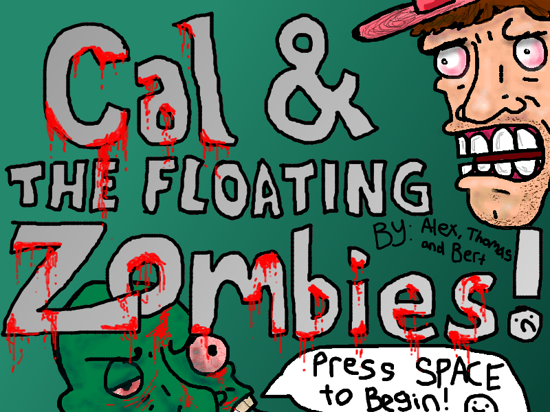

# Cal and the Floating Zombies

My first real project: made in Summer 2011 during CTY camp. (w/ Alex and Albert)
Metal-slug inspired shooter game.
Recently ported as a nostalgia trip.

## Description

Originally developed in 2011 as a final project for a computer science course at CTY.
Developed with Dev-C++ and Allegro 4 on Windows.

Ported from C++03/Allegro 4 to C++17/Allegro 5 in 2024.

No functional changes were made, only syntax and library updates.

Restructuring and refactoring were done only as necessary to speed up porting.

Code brought back from 2011 as-is is in `legacy` branch.

## Prerequisites

- C++ Compiler (e.g. MinGW, MSVC, etc.)
- Make
- Allegro 5.2.9 (Repository includes precompiled binaries for Windows)

## How to run

Currently, the game only is verified to compile and run on a x86_64 Windows 10 machine.

### Windows

1. Clone the repository
2. Run `make` in the root directory
3. Run `make run` to run the game

## Controls

arrow keys: move

space: shoot

## Future

I might continue working on it to finish updating it to modern standards.
There are no plans on adding new features or improving it as a game,
but code quality and maintainability might be improved as a learning exercise/hobby project.

### Known Issues

- Memory leaks from loading assets: unknown if introduced during porting or present in original code (Most likely the latter, as the original code was written by a 13-year-old with no formal training in C++ or game development)
- No support for non-Windows platforms: Allegro 5 is cross-platform, but the game was only tested on Windows

### To-Do

- [ ] Fix memory leaks
- [ ] Add support for non-Windows platforms
- [ ] Replace background and platform sprites with original assets
- [ ] Refactor main loop (only if development continues)
